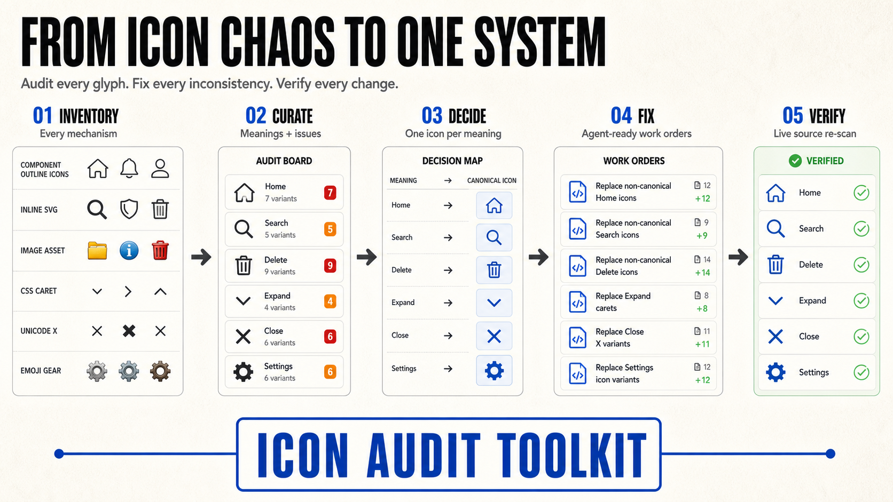

# Icon Audit Toolkit



Two portable Agent Skills that turn scattered icon usage into a visible, fixable,
scan-verified system.

| Skill | What it delivers |
|---|---|
| **`icon-audit`** | Inventories icon-library components, name-string registries, inline SVGs, image assets, CSS masks and data-URI carets, Unicode/emoji/HTML-entity glyphs, broken references, and dead or zombie files. It renders the results as one self-contained HTML audit with real artwork, source links, feature attribution, curated issues, and a canonical icon-per-meaning decision map. |
| **`icon-fix`** | Executes one audit issue end to end: migrate every listed site, keep the audit ledger truthful, rerun the source scan, and prove the cleanup. |

The page is also **the tracker**: issue statuses live next to your code in a curation
module, the build re-runs regex "verify" predicates against your live source (open issues
show remaining-match counts; anything falsely marked fixed gets a public red banner), and
a progress header advances as fixes land. Re-run the two generator commands after each
cleanup batch — the shrinking stats strip is the metric.

## The fix loop, three ways

1. **Copy fix prompt** — every open issue card has a button that copies a complete,
   self-contained work order (problem, fix, every `file:line`, definition of done).
   Paste it into any coding agent.
2. **The icon-fix skill** — `fix X1` in an agent session runs the same contract.
3. **The dispatcher** (`skills/icon-audit/scripts/fix-server.mjs`) — a zero-dependency
   localhost server the page detects. Open issues gain a **▶ fix with &lt;engine&gt;**
   button that spawns a headless agent session, streams its progress into a drawer on the
   page, re-runs the audit on completion, and reloads with the status flipped. Defaults
   to the `claude` CLI; `--runner "<any agent cli>"` (+ `--engine-label "Codex"`) swaps
   engines — the prompt path arrives in `$ICON_FIX_PROMPT_FILE`.

## Install

Skills follow the open [Agent Skills](https://agentskills.io) format (a folder with a
`SKILL.md`), so they work in any agent that speaks it.

**Claude Code — as a plugin (recommended):**

```
/plugin marketplace add https://github.com/timothynice/icon-audit-toolkit
/plugin install icon-toolkit
```

**Claude Code — manual:** copy `skills/icon-audit` and `skills/icon-fix` into
`~/.claude/skills/` (personal) or `<repo>/.claude/skills/` (project).

**Codex CLI:** copy both skill folders into `~/.agents/skills/`.

**Other agents (Copilot CLI, Gemini CLI, …):** copy the skill folders to wherever your
agent discovers Agent Skills, or point it at `skills/icon-audit/SKILL.md` directly. The
skills reference generic tooling only; the scripts are plain Node (≥ 18), zero npm
dependencies.

## Quick start

In a repo, ask your agent to *"audit the icons"* (or invoke `icon-audit`). It will:
recon your icon mechanisms into an `audit.config.mjs` → run the extractor → sweep for
exotic patterns → hand-curate meanings and issues → build
`docs/audits/<date>-icon-audit.html` → leave everything regenerable in
`docs/audits/generator/`.

Then open the page, pick an issue, and either press its button (dispatcher running),
copy its prompt, or tell your agent `fix X1`.

## Safety

The extractor, digest, and page builder are local, zero-dependency scripts and do not
send source code anywhere. The optional fix dispatcher binds to `127.0.0.1` and can
launch an agent with permission to edit the current checkout. Run it only in a trusted
repository, keep the port local, and review the generated work orders before enabling it.

## What's in the box

```
skills/icon-audit/
  SKILL.md                     the workflow + quality bar + red flags
  references/methodology.md    recon table, curation quality bar, issue taxonomy,
                               the fix loop, hard-won gotchas
  references/exotic-sweep-prompt.md   parallel-sweep subagent prompt
  scripts/extract-icons.mjs    config-driven static scan (6 usage mechanisms,
                               import-graph feature attribution, dead-code detection)
  scripts/digest.mjs           human-reviewable digests of the extraction
  scripts/build-audit.mjs      the standalone page builder (light+dark, filtering,
                               progress, scan-verify, copy-prompt buttons; self-checks
                               its emitted script at build time)
  scripts/fix-server.mjs       the localhost fix dispatcher
  templates/                   audit.config example + curation schema
  tests/                       synthetic fixture app with 12 planted findings,
                               ground-truth answer key, and 4 test protocols
skills/icon-fix/
  SKILL.md                     the one-issue fix contract + red flags
```

## Provenance

Extracted from a real audit of a production Vue 3 application (490 files, ~475 icon
usage sites across six mechanisms) and battle-tested: the pipeline reproduces that
audit exactly; the skills were developed test-first against the bundled fixture
(12/12 planted findings, zero false positives); the fix loop's first real run migrated
16 call sites in one button press. See `skills/icon-audit/tests/TESTING.md` to run the
same checks yourself.

## Test

Node 18 or newer is the only requirement; there are no npm dependencies.

```bash
npm test
```

The test runs the extractor and digest against the bundled fixture, checks the documented
inventory counts and false-positive controls, then builds a standalone audit page so the
builder's emitted-script self-check runs too.

## License

MIT — see [LICENSE](LICENSE).
